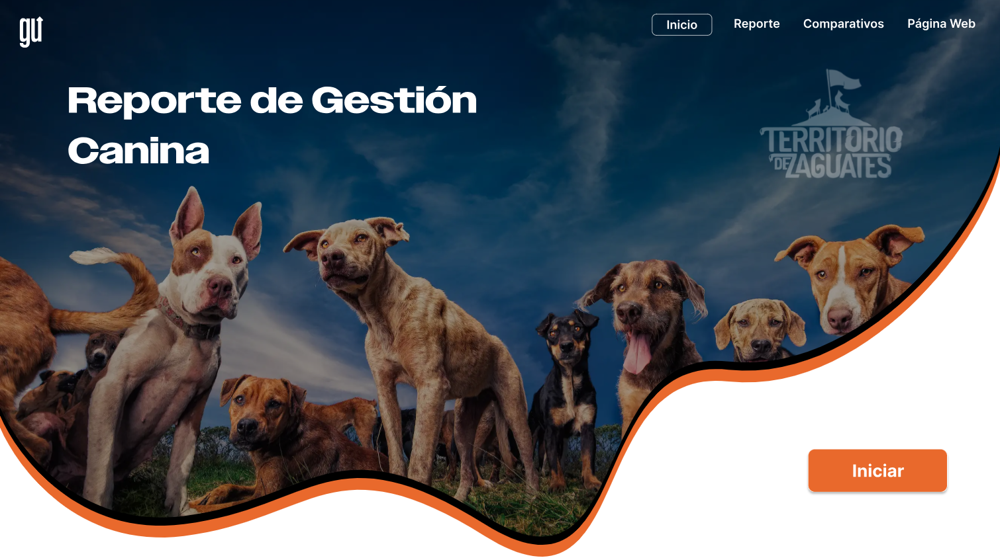

# data-viz-project_canine-shelter-management
The project that reminded me data visualization can have a mission.

# 🐾 Reporte de Gestión Canina — Power BI Dashboard

A data visualization project built as part of a community challenge organized by **[Grow Up Data Analytics](https://www.growupdata.com)**, a Data Analytics education company from Costa Rica. Participants receive mentorship and a real-world brief — and contribute $10 directly to the shelter to fund food and care. Designed for **Territorio de Zaguates**, a real dog shelter located in Costa Rica — using fictional data to simulate their operational reporting needs. Built with a user-centered and mission-centered methodology: from audience definition and brand alignment, through Figma background design, to a fully published multi-tab Power BI dashboard.

## 📋 Executive Summary

This Canine Management dashboard gives the shelter's coordination team a complete operational picture: 1,816 dogs across 10 breeds, managed by 32 rescuers and 176 volunteers. The most prevalent health conditions are Mange (152 cases), Ocular Infection (126), and Dermatitis (122) — data that directly informs veterinary resource planning. The Period Analysis tab reveals a +15.9% YoY growth in dog intake for 2024, with a sharp acceleration in Q4, signaling the need to prepare volunteer and rescuer capacity ahead of year-end. A built-in adoption CTA keeps the shelter's core mission visible at every interaction.

## 🔗 Link

- 📌 [Live Dashboard](https://app.powerbi.com/view?r=eyJrIjoiZjBmODBhNWUtYjE2ZS00NTJmLThlNmItMDRiNTdlNzRhOGE4IiwidCI6IjEyYmMwNzYyLWZiOWEtNDFkNy1iODMyLWIzYWQ1OGE4YzRmOSIsImMiOjR9)
- 🏠 [Territorio de Zaguates](https://www.territoriodezaguates.com) — if this project inspires you, consider donating to the shelter.

---

## 🎬 In Action

### Dog Profile Card — Dynamic Image & Name
Selecting a Dog ID updates the profile card in real time: name, breed, color, age, and health condition — plus a dynamic photo rendered via the **Simple Image** custom visual, pulling from a hosted URL stored in the dataset.

### Rescuer Tooltip
Hovering over a rescuer surfaces a rich tooltip with their photo, status (active/inactive), location, phone, and email — all dynamically bound to the selected context.

### Breed Slicer with Images
A native List Segmentation visual (preview feature) displays each breed with its own photo. Selecting a breed activates the shelter's brand accent color and switches the breed image to full color — inactive options remain grayscale.

### Period Analysis — YoY Comparison
The Period tab allows year-by-year navigation with a full comparative view: intake trend, quarterly size distribution, monthly YoY line chart, and % variation bars with dynamic directional formatting.

### Health View Toggle — Field Parameter
Switching between "Enfermedad" and "Estado de salud" updates both the chart data and the title dynamically — no bookmarks, no duplicate visuals. Built with a field parameter that drives the axis and a `SELECTEDVALUE`-based title measure.

---

## 🗂️ Project Overview

This project involved designing and developing a **multi-tab Canine Management dashboard** in Power BI, simulating a real operational reporting tool for a dog shelter. The goal was to give the shelter's team a powerful, visually engaging tool to monitor dog intake, rescuer activity, volunteer capacity, and health trends — while keeping the shelter's adoption mission front and center.

The process followed a structured methodology: define the audience, define the needs, design the brand system, wireframe in Figma, build, and tell the story with data.

---

## 👤 The User

**Territorio de Zaguates coordination team** — managers and volunteers at a non-profit dog shelter in Costa Rica.

- Needs to monitor **dog intake trends** and capacity planning
- Tracks **rescuer and volunteer** activity across regions
- Requires **health condition visibility** to allocate veterinary resources
- Works in a mission-driven environment where the dashboard itself is a communication tool

---

## 🧭 Methodology

| Pillar | Description |
|---|---|
| **User-centered** | Designed around the shelter's real operational needs, even with fictional data |
| **Mission-centered** | The adoption CTA and shelter link keep the humanitarian purpose embedded in the product |
| **Brand-centered** | Every visual decision — colors, layout, imagery — reflects Territorio de Zaguates' identity |

---

## 🔄 Process

### Step 1 — Define the audience
Identified the coordination team as the primary user: people who need operational clarity at a glance, not analysts running ad-hoc queries.

### Step 2 — Define the needs
Mapped must-have views: dog inventory by breed, size, and health condition; rescuer and volunteer status; and temporal intake trends with year-over-year comparison.

### Step 3 — Define the solution
Designed a dog profile card system driven by a Dog ID slicer — changing name, photo, breed, and health data in real time. Combined with a brand-aligned breed slicer with images, a rich rescuer tooltip, and a period analysis tab, this delivers an experience that feels like a product, not a report.

### Step 4 — Design the brand system in Figma
Built the entire dashboard background in Figma using the shelter's color palette (orange, black, white) and organic, rounded shapes. The Figma background is what transforms a standard Power BI layout into a cohesive, branded data product.

### Step 5 — Build the data model
Designed a star schema with a `Perros` fact table, `Calendario` dimension for time intelligence, and lookup tables for breeds, rescuers, volunteers, and health conditions. Fictional data was generated to simulate realistic shelter operations across 2017–2025.

### Step 6 — Build the report
The report was built in Power BI with special attention to custom visuals, dynamic measures, and brand consistency across all tabs.

### Step 7 — Fine tune & test
Tested filter behavior, tooltip rendering, and image loading across browser environments. Validated YoY calculations against expected values by year.

### Step 8 — Publish
Published to Power BI Service and available as a live public dashboard.

---

## 🛠️ Technical Highlights

- **Dynamic Dog Profile**: `SELECTEDVALUE(Perros[Nombre], " ")` drives the dog name card; breed photo is rendered via **Simple Image** (AppSource custom visual) using a hosted URL field in the dataset (ibb.co).
- **Figma Background**: The entire visual layout — rounded panels, organic borders, color zones — was designed in Figma and imported as a background image. Without this layer, the report would be a standard Power BI canvas. This is the single biggest UX differentiator.
- **Breed Slicer with Images**: Built with the native **List Segmentation** preview visual, configured with `img_raza` field and brand accent color on selection. Inactive breeds appear grayscale; selected breed activates full color.
- **Rescuer Tooltip**: A custom tooltip page surfaces rescuer photo, active status indicator, region, phone, and email — dynamically filtered by hover context.
- **Time Intelligence — YoY**:
  - `Total Perros LY = CALCULATE([Total perros], SAMEPERIODLASTYEAR(Calendario[Date]))`
  - `% Variación vs LY = DIVIDE([Variación Total_perros vs LY], [Total Perros LY])`
  - Dynamic string format `"+0.0% ▲ ;-0.0% ▼; N/A"` renders directional indicators natively in the measure output.
- **Field Parameter — Health Toggle**: A field parameter allows switching the health chart between "Enfermedad" (condition) and "Estado de salud" (health status) views. The chart title updates dynamically based on the selected parameter, so the visual always self-describes without requiring a legend or annotation.
- **Adoption CTA**: A "¡Adopte un zaguate!" button links directly to the shelter's website — the dashboard is also a mission communication tool.
- **Accessibility**: Colorblind-considerate palette; grayscale-to-color state change in the breed slicer provides a non-color-dependent selection signal.

---

## 📐 Dashboard Structure

| Tab | Focus |
|---|---|
| **Inicio** | Landing page with shelter branding and navigation entry point |
| **Reporte** | Dog inventory: breed, size, sex, health conditions, and individual dog profile card |
| **Comparativos** | Period analysis: YoY intake trends, quarterly size distribution, monthly % variation |
| **Página Web** | Link to Territorio de Zaguates for adoption and donation |

---

## 💡 Key Insights

- **Total dogs**: 1,816 across 10 breeds, average age 6 years.
- **Dominant breed**: Zaguate (mixed breed) represents ~1,100 of total dogs.
- **Sex distribution**: 56% male, 44% female.
- **Top health conditions**: Mange (152), Ocular Infection (126), Dermatitis (122), Renal Insufficiency (119).
- **2024 intake**: 241 dogs — a +15.9% increase vs. 2023 (208 dogs), with Q4 acceleration.
- **2025 trend** (partial year): -33.6% vs. same period prior year, warranting monitoring.
- **Rescuer capacity**: 23 active rescuers out of 32 total; 116 active volunteers out of 176.

---

## 🧰 Tools Used

| Tool | Purpose |
|---|---|
| Power BI | Dashboard development, DAX, data modeling |
| Figma | Background design and brand system |
| DAX | Time intelligence, dynamic measures, string formatting |
| Simple Image (AppSource) | Dynamic dog and rescuer photo rendering |
| List Segmentation (Preview) | Image-based breed slicer with brand color states |
| ibb.co | Image hosting for dynamic URL-based photo rendering |

---

## 📌 Strategic Recommendations

1. **Prepare for Q4 surge** — The consistent intake acceleration in Q4 (reinforced by 2024 data) calls for proactive rescuer recruitment and veterinary resource allocation starting in September.
2. **Prioritize Mange treatment capacity** — With 152 cases, Mange is the leading health condition. A dedicated treatment protocol and supply chain would reduce shelter load and improve adoption readiness.
3. **Monitor 2025 intake drop** — The -33.6% YoY decline in the first months of 2025 may reflect seasonal patterns or data completeness. Establish a monthly review cadence to distinguish trend from noise.

## ⚙️ Operational Recommendations

1. **Activate inactive rescuers** — 9 of 32 rescuers are inactive; a re-engagement campaign could meaningfully expand field capacity without new recruitment costs.
2. **Leverage volunteer base** — 60 inactive volunteers represent a significant untapped resource. Targeted re-activation — especially ahead of Q4 — could absorb intake growth without structural changes.
3. **Diversify breed intake tracking** — All non-Zaguate breeds represent a small fraction of total intake. Tracking breed-specific health patterns could improve triage and placement matching.

---

## ⚠️ Caveats & Assumptions

1. **Fictional data** — All records were synthetically generated to simulate realistic shelter operations. The dashboard structure and measures are production-ready; the data is not real.
2. **Image hosting** — Dog and rescuer photos are hosted on ibb.co. In a production environment, a more stable hosting solution (Azure Blob Storage, SharePoint) would be recommended.
3. **Preview visual** — The List Segmentation slicer is a Power BI preview feature; behavior may change in future releases.
4. **2025 data** — Only partial-year data is available for 2025; YoY comparisons for this period should be interpreted with caution.
5. **Health conditions** — A dog may have multiple conditions; counts represent condition occurrences, not unique dogs.

---

## 🔮 Future Improvements

1. **Geographic map** — Add a regional map showing rescuer coverage and intake hotspots by province or canton in Costa Rica.
2. **Adoption funnel** — Track the full journey from intake to adoption: time in shelter, health clearance, adoption rate by breed and size.
3. **Volunteer engagement score** — Build a composite metric combining activity frequency, region coverage, and tenure to prioritize re-engagement outreach.
4. **Mobile layout** — Design an optimized mobile view so shelter staff can consult key metrics from the field.
5. **Stable image hosting** — Migrate photo URLs from ibb.co to Azure Blob Storage for reliability and access control.

---

## 🐕 My Personal Experience with This Project

Building a dashboard for a real shelter — even with fictional data — changes how you think about every design decision. When the end user is someone trying to place a dog in a home, or a rescuer coordinating across regions, "nice to have" features stop being decorative and start being operational.

The Figma background was the decision that unlocked everything else. Without it, this is a functional report. With it, it becomes a product that feels like it belongs to Territorio de Zaguates — and that distinction matters when the dashboard is also a communication tool for the shelter's mission.

The breed slicer with images was technically simple but strategically important: it makes the data feel alive. You're not filtering by "Zaguate" — you're selecting a dog.

The hardest part was recreating the Figma background from scratch. The challenge resources came partially pre-set — there was only one lesson covering one of the pages, and no access to the original Figma file. So I reverse-engineered the visual system and rebuilt it myself. That constraint turned into one of the most satisfying moments of the project: the result gave me a navigation structure so clear and intuitive that I ended up replicating it in other dashboards. Sometimes the locked door is the best teacher.

One year later, I'd add a geographic layer and a proper adoption funnel. But for a challenge built in a tight timeframe, I'm proud of what this became.

I hope you enjoy it — and if you do, consider visiting [Territorio de Zaguates](https://www.territoriodezaguates.com). 🐾

*Loa*

---

*Data: synthetically generated to simulate shelter operations. Developed as part of a community challenge by [Grow Up Data Analytics](https://www.growupdata.com) (Costa Rica), where learning and impact go hand in hand.*
